.. _ngq_rosreestr_cadaster:

Работа с кадастровой картой
===========================

.. _ngq_rr_add_layer:

Подключение кадастрового слоя
-----------------------------

Вторая иконка модуля **NGQ Rosreestr Tools** |icon_add_layers| позволяет добавлять различные слои данных Росреестра (см. :numref:`add_layers_pkk`) из публичной кадастровой карты (далее - ПКК):

* слой кадастровых кварталов, округа
* слой земельных участков, ОКС (Объекты капитального строительства)
* слой зон с особыми условиями использования

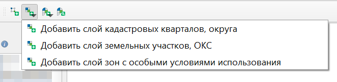
   
   Добавление слоёв из ПКК

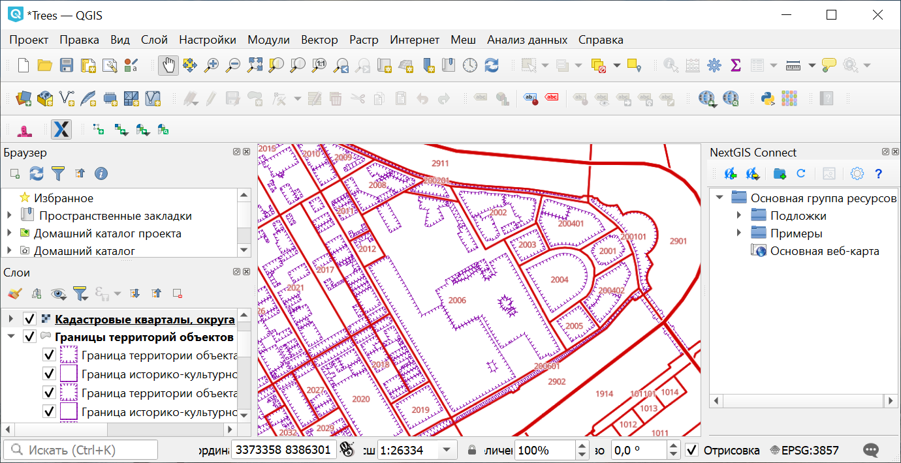
   
   Слой кадастровых кварталов на карте

Добавлять слои данных  Росреестра из ПКК так же можно через Панель “Браузер”.

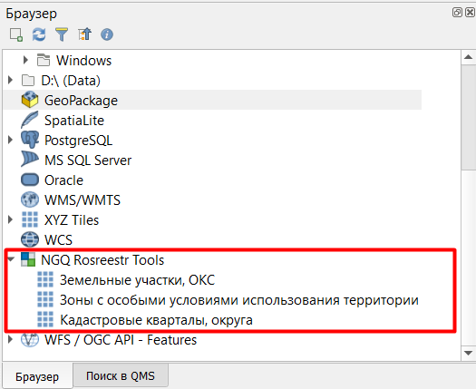

   Добавление слоёв из ПКК через панель "Браузер"

.. _ngq_rr_indentify:

Идентификация кварталов и участков
----------------------------------

Третья иконка |identificaion_land| позволяет по клику на объект идентифицировать (см. :numref:`identificaion_objects`) атрибутивную информацию по:

* |identificaion_land| земельным участкам
* |identification_oks| кадастровым кварталам
* |identification_quarter| объектам капитального строительства (ОКС)
* |identification_zones| зонам с особыми условиями использования территорий (ЗОУИТ)

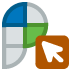

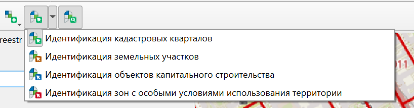
   
   Идентификация объектов Росреестра
   
По клику отображается список объектов выбранного типа, найденных в этой точке. Первый из них будет подсвечен.

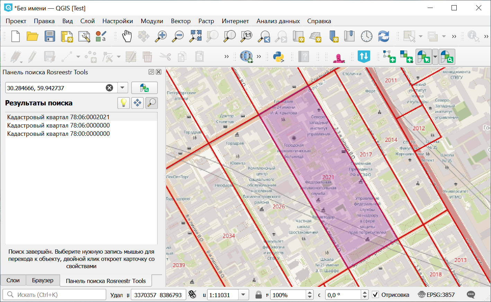

   Список найденных кадастровых кварталов и подсветка контура первого из них

Нулевые кварталы соответствуют более крупной единице деления. В примере выше это район и город.

Двойной клик по объекту в списке открывает его карточку. Чтобы переходить между объектами, используйте выпадающее меню сверху.

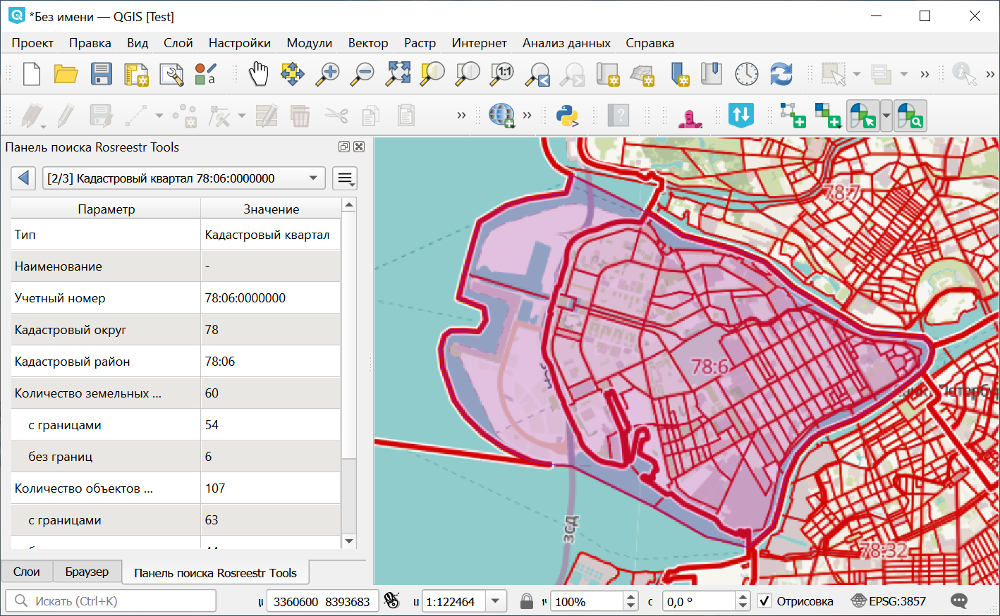
   
   Отображение карточки найденного объекта и подсветка его контура

При идентификации объект можно сохранить в пользовательский векторный слой, а также создать специальный слой со структурой идентифицируемого объекта. Аналогично при поиске объектов: найденные объекты можно добавлять в пользовательские или специальные векторные слои (см. :numref:`ngq_identification`, :numref:`ngq_temp_layer`).

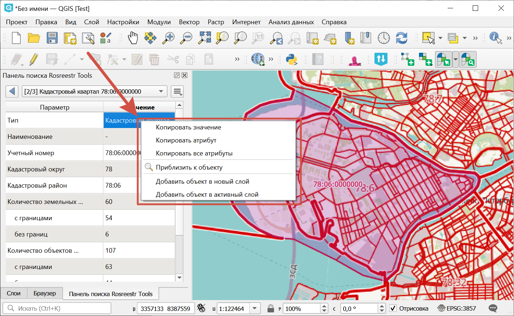
   
   Доступные опции при идентификации объекта
   
   
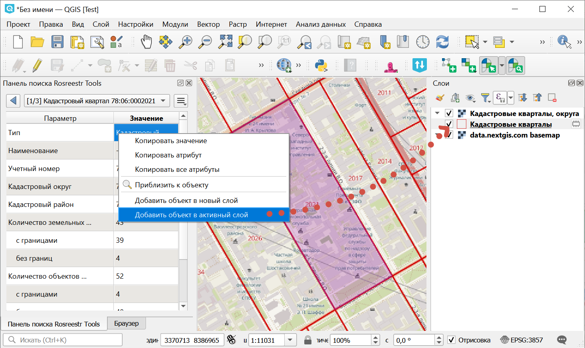
   
   Добавление объекта во временный пользовательский слой
   
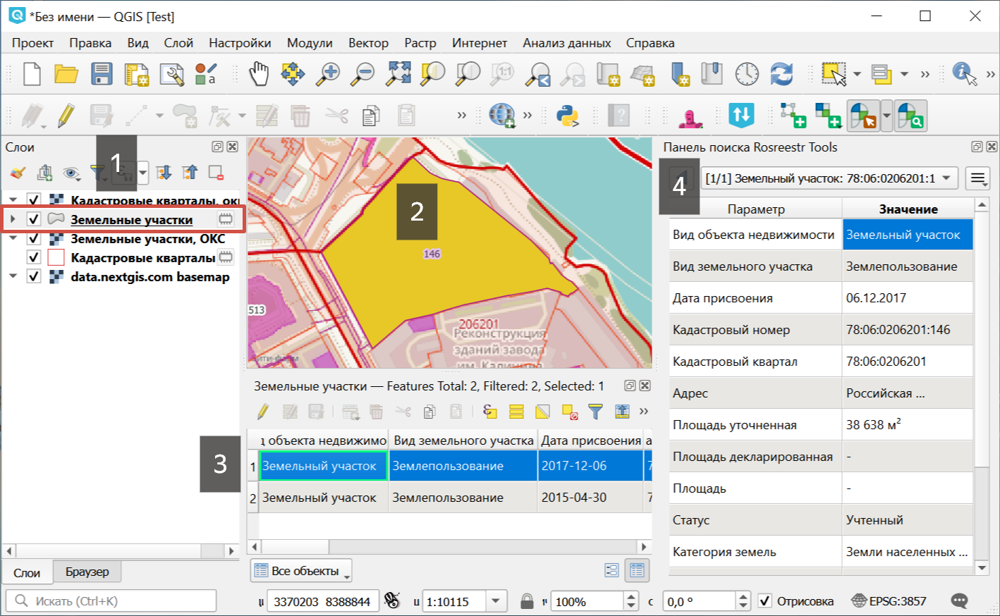
   
   Объект во временном слое. 1 - временный слой, 2 - объект на карте, 3 - таблица атрибутов временного слоя, 4 - карточка информации об объекте
   
Также можно скопировать запись (строку), значение отдельного атрибута или всю карточку.  

Поля, содержащие большие числа и единицы измерения, представлены в атрибутах объекта в двух вариантах: с форматированием и без.

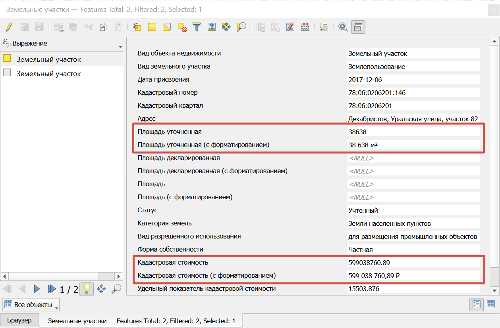

   Поля с визуальным форматированием больших чисел и единиц измерения

.. _ngq_rr_search:

Поиск по кадастровому номеру
----------------------------

Иконка панели поиска |search_icon| позволяет находить объекты, имеющие границы из базы данных Росреестра (см. :numref:`search_object`), по кадастровому номеру.

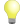

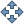

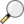

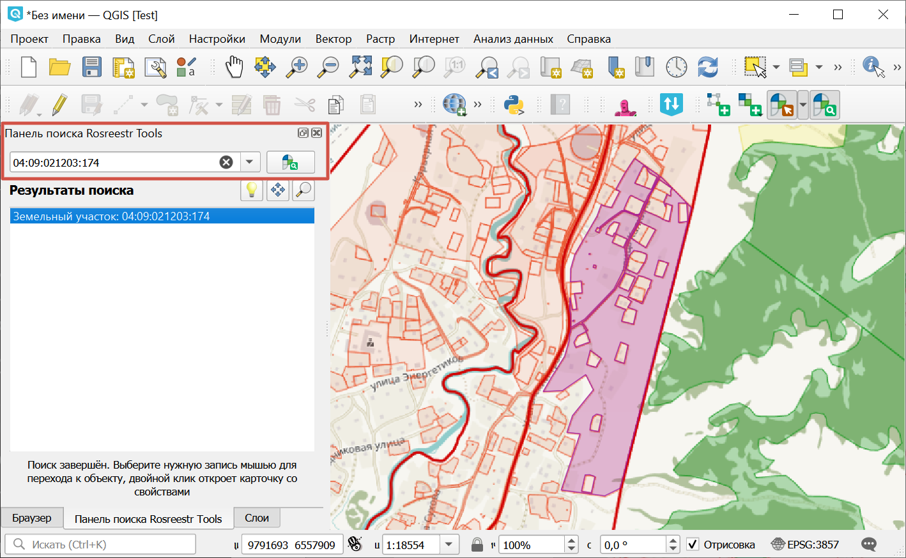
   
   Отображение списка найденных объектов и подсветка контура выделенного

Вы можете выбрать, как показывать объекты при поиске:

* |HighlightFeature| Отображать все найденные объекты одновременно (объекты подсвечиваются полупрозрачной заливкой и наслаиваются друг на друга);
* |PanTo| Автоматически перемещаться к выбранному объекту;
* |ZoomTo| Автоматически приближать к выбранному объекту.

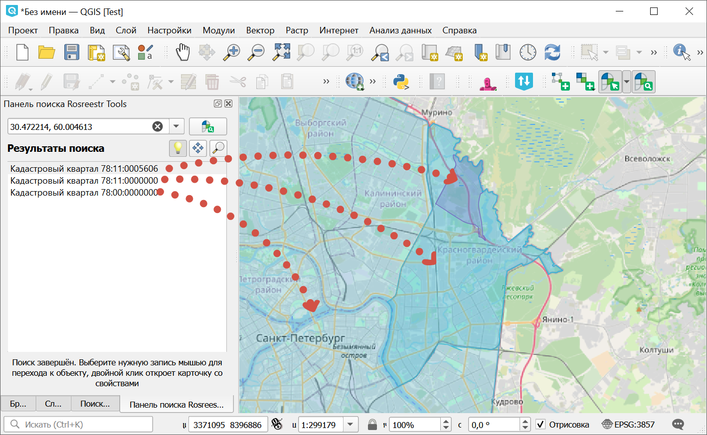

   Подсвечены одновременно три найденных объекта. Они накладываются друг на друга и отличаются плотностью заливки

Для снятия выделения щелкните по пустому полю под списком.

Дважды щёлкните по объекту в списке, чтобы перейти к его карточке.

В карточке объекта отображается статистика: сколько кварталов, участков и ОКС он включает в себя.

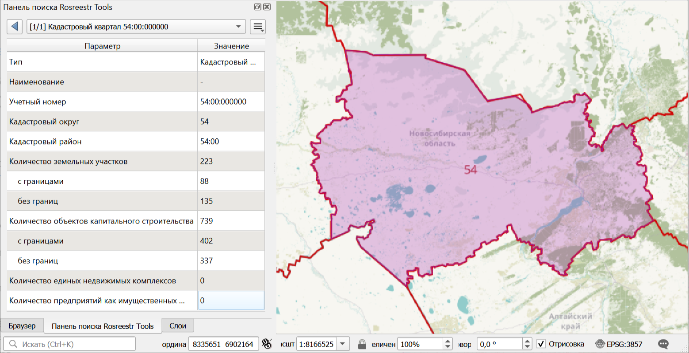

   Статистические данные квартала

Поддерживается поиск объектов без геометрий. Можно просмотреть карточку объекта и добавить его на слой. Примерное местоположение объекта на карте будет отмечено точкой.

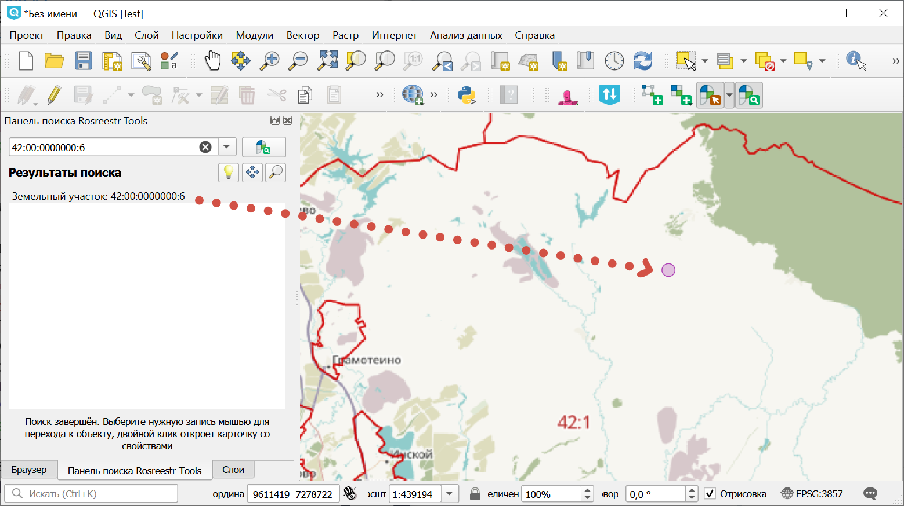
   
   Отображение карточки найденного объекта без геометрии

Процесс поиска объекта по кадастровому номеру можно посмотреть на этом `видео <https://youtu.be/ig6jreu-I9E>`_.

Также доступно подключение кадастровых сервисов для NextGIS Web on-premise для работы на веб-карте.

